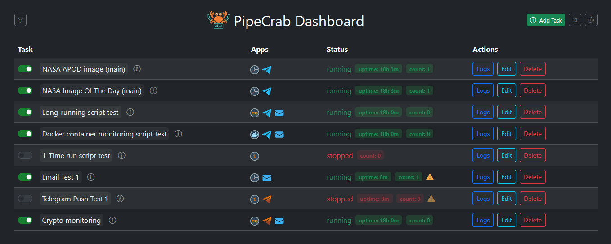

# PipeCrab Dashboard

[]() [](https://fastapi.tiangolo.com/)

**PipeCrab Dashboard** is a lightweight experimental dashboard for managing and monitoring Python scripts.

It lets you:

- Add tasks and launch them manually or on a cron schedule.
- Monitor uptime and count script launches.
- View detailed logs with real-time updates and error highlighting.
- Connect Telegram bots to your scripts for extra control and notifications.

Two sample scripts are included:

- Posting NASA's Astronomy Picture of the Day (APOD) to Telegram.
- Posting NASA's Image of the Day (from RSS feed) to Telegram.

---

## Screenshots



---

## Key Features

- Simple script management with start/stop toggles.
- Cron scheduling support per task.
- Modes: Cron scheduling, 1-Time Run, Long-Running, Docker monitoring (logic in progress).
- Uptime tracking and launch counters for each task.
- Log viewer with real-time updates and error highlighting.
- App-level filters and tag bar for advanced dashboard filtering.
- SQL Server support for task persistence via `dbo.Tasks` table (optional).
- Telegram bot integration with `--bot` and `--push` modes, Email notification support.
- Clean UI with Bootstrap 5, including dark/light theme toggle.

For usage instructions, see [USAGE.md](USAGE.md)

---

## Tech Stack

- **Backend:** FastAPI + Uvicorn
- **Frontend:** HTML + Bootstrap 5 + Vanilla JavaScript + Axios
- **Scheduling:** [APScheduler](https://apscheduler.readthedocs.io/en/stable/) for per-task cron jobs 
- **Cron rendering:** [cronstrue](https://github.com/bradymholt/cronstrue) via CDN (for human-readable cron expressions)
- **Database:** Optional MS SQL Server integration via ODBC
- **Notifications:** Telegram Bot API (posting and push alerts), SMTP for Email  


---

## Requirements

- Python 3.10 or higher
- Installed project dependencies (`pip install -r requirements.txt`)

Run via `start.bat` (Windows) or manually:

Production:
```bash
python -m uvicorn app.main:app --host 127.0.0.1 --port 8000
```

Development (auto-reload):
```bash
python -m uvicorn app.main:app --host 127.0.0.1 --port 8000 --reload
```

Once running, access the dashboard at [http://127.0.0.1:8000/dashboard](http://127.0.0.1:8000/dashboard)

## Purpose

- The dashboard was created as a learning tool to explore backend/frontend integration, subprocess management, real-time updates, and dashboard design.

---

Crafted with care. Moving forward to new challenges.

